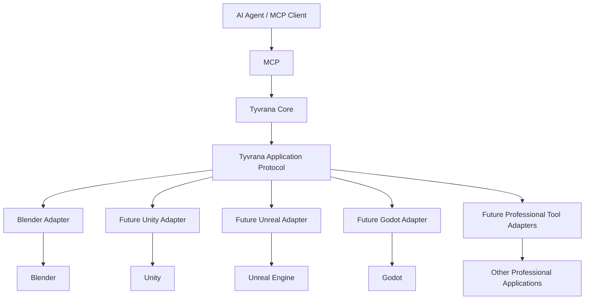

<div align="center">

# Tyvrana

### Autonomous AI creation across professional 3D tools

**Create. Modify. Run. Inspect. Fix. Verify.**

[tyvrana.com](https://tyvrana.com) · [Repositories](https://github.com/orgs/tyvrana/repositories)

</div>

---

## What is Tyvrana?

**Tyvrana** is an open-source, general-purpose AI creation system for 3D assets, scenes, applications, games, and XR experiences.

It is designed to let AI agents work across professional creation tools at a higher level than simple editor command execution.

Tyvrana aims to combine the capabilities of a:

- 3D artist
- technical artist
- game developer
- software engineer
- QA engineer

into an autonomous workflow that can create something, inspect the actual result, detect problems, correct them, and verify that the result works.

## Architecture



The AI-facing interface is **MCP**.

`tyvrana-core` runs locally and coordinates application adapters through a typed, application-independent Tyvrana protocol.

Application-specific behavior stays in the corresponding adapter.

## More than editor automation

Tyvrana is being built around workflows such as:

```text
create / modify
      ↓
render / run
      ↓
inspect the actual result
      ↓
detect problems
      ↓
correct them
      ↓
rerun / rerender
      ↓
verify
```

An API call returning successfully does not necessarily mean the creative result is correct.

Tyvrana is designed around **observable results and iterative verification**.

## Project-wide understanding

A professional project rarely exists inside only one application.

Tyvrana is designed to eventually understand relationships such as:

```text
Blender source asset
        ↓
exported asset
        ↓
Unity / Unreal imported asset
        ↓
prefab / actor
        ↓
scene usage
        ↓
runtime behavior
```

This allows a high-level change to become one coordinated operation across the toolchain rather than a collection of unrelated editor commands.

## Current development

Tyvrana is under active development.

### Blender

The Blender adapter is the current production focus and already supports a growing typed workflow including:

- scene and object inspection
- cameras and lighting
- rendering and visual verification
- materials and shader graphs
- image and artifact workflows
- UV workflows
- semantic mesh modeling
- modifiers
- sculpting and Multiresolution
- masks, Face Sets, and sculpt filters
- voxel-remesh blockout workflows
- production retopology tools

Development is benchmark-driven: real assets are used to expose missing capabilities and inefficient workflows rather than adding editor commands speculatively.

### Future applications

Additional adapters will be developed when work on those integrations begins.

Planned areas include:

- Unity
- Unreal Engine
- Godot
- additional professional 3D and design tools

Tyvrana remains application-independent at the core.

## Repositories

### [tyvrana-core](https://github.com/tyvrana/tyvrana-core)

Local orchestration service and MCP interface.

Responsible for sessions, adapter communication, tool routing, artifacts, project orchestration, and other application-independent runtime concerns.

### [tyvrana-blender](https://github.com/tyvrana/tyvrana-blender)

Blender adapter for Tyvrana.

Provides typed Blender operations while preserving Blender-specific implementation inside the adapter.

### [tyvrana-protocol](https://github.com/tyvrana/tyvrana-protocol)

Shared application-independent schemas and contracts used between Tyvrana Core and application adapters.

## Design principles

**Local first**

Tyvrana's initial architecture runs locally and works directly with professional applications on the user's machine.

**Typed operations first**

Structured operations are preferred over arbitrary script execution.

**Application-independent core**

Blender, Unity, Unreal, Godot, and other application logic belongs in dedicated adapters.

**Visual and runtime verification**

Tyvrana should inspect what was actually created or executed rather than assuming success from an API response.

**Benchmark-driven development**

New capabilities should solve demonstrated creative-workflow needs rather than simply expanding a command list.

**Inspectable autonomy**

Autonomous work should remain understandable, testable, and debuggable.

## Vision

Tyvrana's long-term goal is a workflow where a user can describe a complete result at a high level and an AI agent can coordinate the necessary professional tools to produce it.

For example:

> Create a small playable 3D game.

Tyvrana should be able to coordinate the work required to:

```text
create assets
    ↓
prepare and transfer them
    ↓
build the game scene
    ↓
implement behavior
    ↓
run the application
    ↓
inspect visuals and runtime state
    ↓
detect problems
    ↓
fix them
    ↓
rerun and verify
```

without requiring manual copy/paste between the AI agent and individual editors.

---

<div align="center">

**Tyvrana is under active development.**

[tyvrana.com](https://tyvrana.com)

Licensed under the **Apache License 2.0**.

</div>
